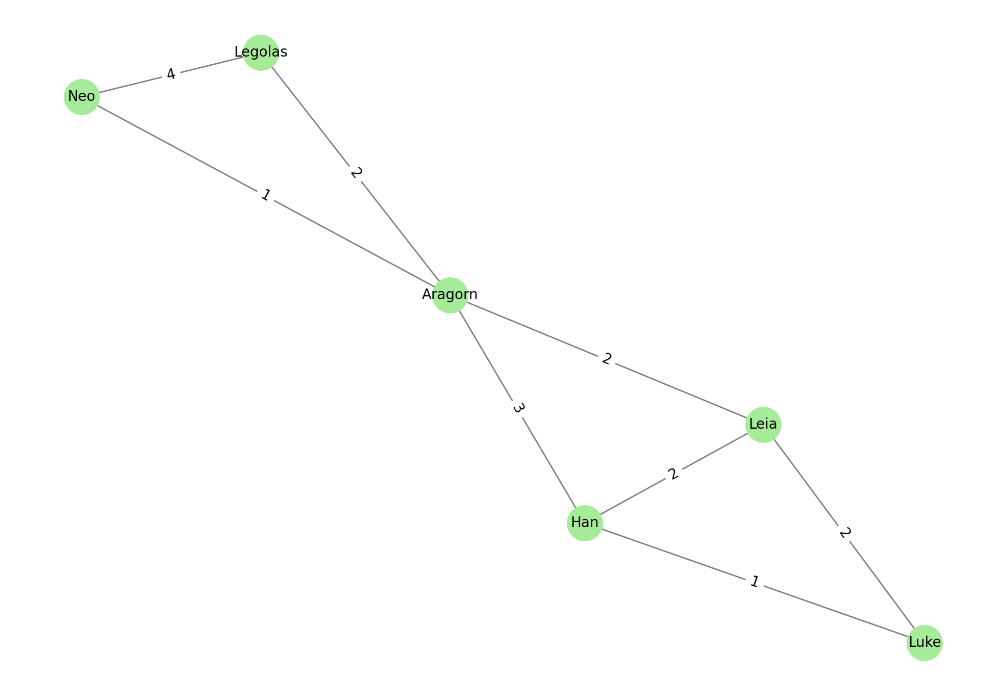

# Dijkstra's Algorithm Analysis

This analysis presents the shortest paths between all pairs of nodes in a social network graph using Dijkstra's algorithm. Each edge in the graph has an assigned weight, representing the cost of moving from one node to another.

## Key Observations:

- The shortest paths are calculated based on **minimum total weight**, not necessarily the fewest steps.
- The algorithm ensures that the **total weight** of the path from the source to each node is the smallest possible.
- Some paths with more steps can have a lower total weight due to the edge weights.

## Explanation:

For example:

- From **Luke to Neo**, the shortest path is `Luke → Han → Aragorn → Neo` with total weight **5**, even though there exists another path through Leia with the same number of nodes but a higher total weight.
- From **Neo to Luke**, the path is `Neo → Aragorn → Leia → Luke`, with a total weight of **5** as well. This highlights Dijkstra's ability to find optimal paths in undirected, weighted graphs.

The variation in paths is a result of the weights assigned to edges. The algorithm always selects the path with the **lowest cumulative cost**, not necessarily the visually shortest or fewest-hops route.

All paths and their weights were verified and are consistent with the edge weight assignments in the graph.

## Conclusion:

Dijkstra's algorithm efficiently determines the shortest path by weight for all node pairs. In contrast to DFS and BFS, which operate based on structure (depth or breadth), Dijkstra takes cost into account, making it ideal for routing and real-world navigation tasks.

## Visualization

