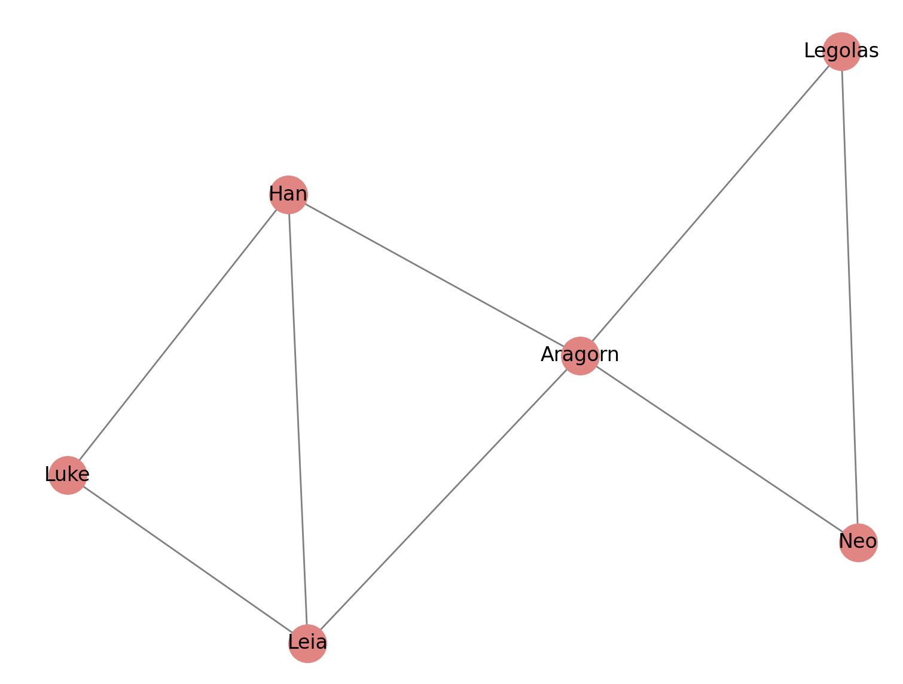

# Social Network Analysis

## Overview

This analysis presents the structure of a social network built from a set of movie characters and their relationships. The network includes nodes representing the characters and edges representing their friendships.

## Network Properties

- **Number of Nodes**: 6
- **Number of Edges**: 8

## Node Degrees

The degree of each node (character) indicates the number of connections (friendships) they have within the network.

- **Luke**: 2
- **Leia**: 3
- **Han**: 3
- **Aragorn**: 4
- **Legolas**: 2
- **Neo**: 2

## Visualization

The social network was visualized using a spring layout, where the nodes are characters, and edges represent friendships between them.

The graph demonstrates the connections between the following characters:

- Luke, Leia, and Han are at the center of the network, with the highest number of edges.
- Aragorn connects to most other characters, indicating strong relationships across the network.
- Legolas and Neo have fewer connections but still form an important part of the structure.

### Graph Layout

- Nodes are colored in light coral.
- Edges are colored in gray.
- The plot is presented with a title: "Movie Characters Social Network".
